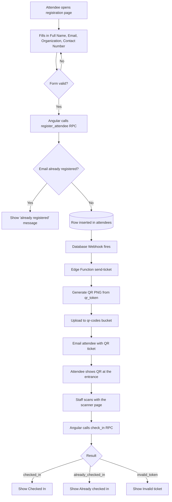

# Flowchart

```mermaid
flowchart TD
    A[Attendee opens registration page] --> B[Fills in Full Name, Email, Organization, Contact Number]
    B --> C{Form valid?}
    C -- No --> B
    C -- Yes --> D[Angular calls register_attendee RPC]
    D --> E{Email already registered?}
    E -- Yes --> F[Show 'already registered' message]
    E -- No --> G[(Row inserted in attendees)]
    G --> H[Database Webhook fires]
    H --> I[Edge Function send-ticket]
    I --> J[Generate QR PNG from qr_token]
    J --> K[Upload to qr-codes bucket]
    K --> L[Email attendee with QR ticket]
    L --> M[Attendee shows QR at the entrance]
    M --> N[Staff scans with the scanner page]
    N --> O[Angular calls check_in RPC]
    O --> P{Result}
    P -- checked_in --> Q[Show Checked In]
    P -- already_checked_in --> R[Show Already checked in]
    P -- invalid_token --> S[Show Invalid ticket]
```
